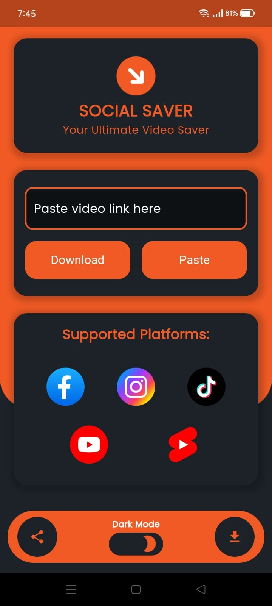

# tiktok_downloader

Tiktok downloader application with RESTFUL API designed by flutter

## 📷 Previews

- Splash Screen
  

- Home preview with Light & Dark Modes
   

- Get Download Links
  

- Select Download Links 
  

- Downlaoding Screen
  

## TikTok downloader app with:
- Bloc state-management
- Clean architecture & clean code

## Features:
- Download TikTok videos by link
- Open video if download success
- Retry download if failed
- Create specific folder for downloaded videos
- Save video in gallery

## Packages used:
- [Dependency injection by get_it](https://pub.dev/packages/get_it)
- [internet connection checker](https://pub.dev/packages/internet_connection_checker)
- [dartz](https://pub.dev/packages/dartz)
- [equitable](https://pub.dev/packages/equatable)
- [Dio for requests and download videos](https://pub.dev/packages/dio)
- [permission_handler](https://pub.dev/packages/permission_handler)
- [play video by open_file](https://pub.dev/packages/open_file)
- [get app path by path_provider](https://pub.dev/packages/path_provider)
- [gallery_saver for save videos in gallery](https://pub.dev/packages/gallery_saver)
